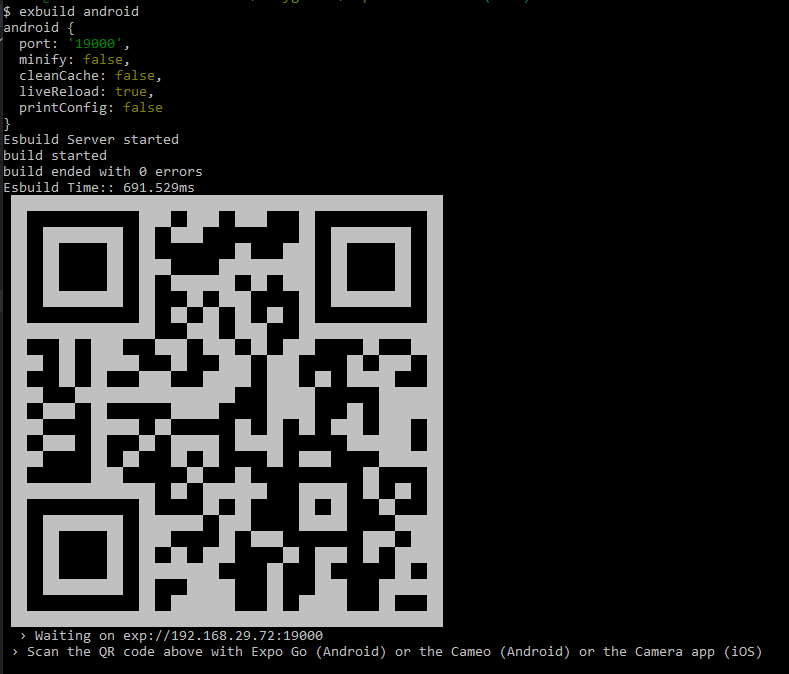

# exbuild

Use **esbuild** with **react-native** and **Expo Go** in development or with **react-native-web**.
It aims to bring to the react-native/react-native-web world the simplicity and speed of Esbuild.

**WARNING**: This is experimental and currently just a proof of concept.

Esbuild is a very fast bundler. You can use this tool to prototype react-native or react-native-web projects. It is really fast. The first build in native will be a little longer because the react-native code will be cached to remove the flow types, but the subsequent builds will be really fast.

The react-native-web projects will run in an HTTP development server with livereload. The react-native projects for android will run in the Expo Go app. You can use the barcode to open the project in the expo app, like a normal expo app.

I am sorry, iOS users, but it doesn't work whit iOS yet. Help wanted.

For native (android) Exbuild requires Expo 41.0.0

## Install

`$ npm i exbuild`
or
`$ npm i -g exbuild`

## Usage

```
$ exbuild --help
Usage: exbuild <android | ios | web | init> [options]

Options:
  -v                        output the version number
  -p, --port <number>       port number (default: "19000")
  -m, --minify              Minify (default: false)
  -c, --clean-cache         Clean cache (default: false)
  -r, --live-reload         Live reload (default: true)
  -n, --print-config        Print internal config (default: false)
  -f, --config-file <path>  Path to a config file
  -h, --help                display help for command
```

### web

`$ exbuild web` will bundle the project and open the `dist/index.html` page in the browser in `localhost:3000`.
You can build for production with the option `-m, --minify`
If no `dist/index.html` exists Exbuild will create one.

### native (android)

`$ exbuild android` will bundle the project and show a barcode in the terminal to open the app in Expo Go. If the debug option is enabled in the developer menu in the app, the debugger will be open in `http://localhost:19000/debugger-ui/`.
The app will reload every time a file is saved. To disable it use `--live-reload false`



### init

It is possible to create a new project easily with Exbuild. You just need to use `$ exbuild init`, and it will create a new basic project in the current folder.

```
mkdir myApp
cd myApp
exbuild init
exbuild web
   or
exbuild android
```

It is really fast to have the project running, comparing with react-native-cli or expo.
Because it, Exbuild is very good for prototyping.

## Config

It is possible to customize the [**esbuild**](https://esbuild.github.io/api/#build-api) options with a config file (json or js).
`exbuild android --config-file path_to_file` or `exbuild web -f path_to_file`
To see all defaults use the option `-n` or `--print-config`.
The custom Esbuild options need to be defined by platform.
The custum config will be merged with the internal default config.

```javascript

module.exports = {
  android: {
     {
      define: {
         'process.env.TEST_APP_ID': 'asdf',
      }
      inject: [
        './node_modules/package-polyfill/index.js'
      ]
      tsconfig: 'tsconfig.json',
      banner: {
        js: `console.log('app started!!')`
      }
      plugins: [
         [
           /* internal plugins */
            {
              name: 'exbuildAlias',
              params: {
                // import 'npm-pkg' >> import './node_modules/other-npm-pkg/index.js'
                'npm-pkg': './node_modules/other-npm-pkg/index.js',
                // import 'npm-pkg/foo.js' >> import './node_modules/other-npm-pkg/foo.js'
                'npm-pkg/': './node_modules/other-npm-pkg/'
              }
            },
            {
               name: 'exbuildRemoveFlow',
              params: ['react-native-pkg-with-flow']  // packages with flow types
            },
            {
              name: 'exbuildAssets',  // treat the extension as asset
              params: [ 'docx', 'doc' ]
            },
            /* external plugins */
            esbuildEnvPluigin,
            esbuildOtherPlugin(config)
          ]
    },
  },
  web: {
    ...
  }
}

```

Exbuild have three internal plugins that can be parameterized.
The Exbuild config extends the Esbuild plugins with the property `params`

```javascript
interface Plugin {
  name: string;
  setup: (build: PluginBuild) => void | Promise<void>;
  params: object | stringp[];
}
```

You can use `params` to customize the internal plugins, as in the example above.
The external Esbuild plugins can be used as usual.
The internal Exbuild plugins are:

#### - exbuildAlias

It allow to replace modules or files, like tsconfig "paths" or babel-plugin-module-resolver.
It uses a [import-maps](https://github.com/WICG/import-maps) algorithm to resolve the paths.
Paths without a trailing slash needs to be resolved to a file.
Paths with a trailing slash in both sides act as a prefix replacement:

```json
{
  "lodash": "./node_modules/lodash-es/lodash.js",
  "lodash/": "./node_modules/lodash-es/"
}
```

```javascript
import _ from "lodash" >> import _ from "./node_modules/lodash-es/lodash.js"
import fp from "lodash/fp.js" >> import _ from "./node_modules/lodash-es/fp.js"
```

#### - exbuildAssets

Internally this plugin manage the asset files.
You can configure other files extensions to be manage as an asset.
You need to include these extension in the Esbuild `loader` option alse, having `file` as loader.

#### - exbuildRemoveFlow

As several react-native packages use flow for types and they are published without transpilation, we need stripe the types from the code of this packages, which is done by this plugin.
The default configuration already includes several packages including react-native.
You can check which packages are already included with `-f` or `--print-config` in the command line.
Remove flow is a slow process. Because of that, the result is cached in the file `.expo/exbuid/cache/removed-flow.json`.

**Important:** The cache is not invalidated automatically. You need to clean the cache (`-c` or `--clean-cache`) every time you update one package in which the plugin is acting.

## Test cases

This tool was tested in the following projects:

- expo-basic template
- expo-nav template (typescript)
- [react-native-paper/example](https://github.com/callstack/react-native-paper/tree/main/example) (updated to expo 41.0.0)
- [react-native-paper-login-template](https://github.com/callstack/react-native-paper-login-template) (updated to expo 41.0.0)
- [expo/apps/native-component-list](expo/tree/master/apps/native-component-list) only native(android) for now
- [expo/apps/test-suite](https://github.com/expo/expo/tree/master/apps/test-suite) only native(android). almost all tests passed
- [timetable](https://github.com/EarlGeorge/timetable) native(android)

### Caveats

- No iOS for now
- No fast-refresh, only live-reload for web and native
- No icon and splash screen
